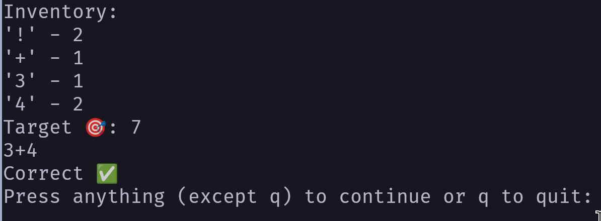

# Premise
Computer Society audience-driven game where members contribute ideas and see them implemented in real time.
Members would then have the opportunity to extend the game with their own ideas or unimplemented ones from the meeting.
## Basic game starting concept
- The concept of this game was adapted from this [steam game](https://store.steampowered.com/app/3043740/Calculate_It/)
- There are rounds
- If you fail a round, the game ends
- The objective is to stay alive for as many rounds
- You're given an inventory of mathematical symbols (numbers, operations, etc)
- each round
    - You must get to a target value by creating a mathematical expression with your symbols
    - You consume the symbols used in your expression
    - If you don't get the target value, you fail
## Meeting Organization
- Members write down an **ANY** addition to the game (i.e., adding another operation)
- The note will be folded up and placed up front
- Once we have some amount of suggestions, we'll pick one at random
    - This will then be live implemented as fast as possible

## Ideas from club members not implemented
- colors
- lootboxes
- choose items
- power-ups (could be in lootboxes)
    - Draw three items for inventory
    - You can fail a round
- add a streak message (encouragement)
- difficulty
    - select difficulty
    - higher range of targets
    - fewer numbers and operators
- make every target possible
    - easier to generate all possible then choose
- Add a help command for the game
- Change the way the scoring works
    - Using fewer symbols gives more points?
    - Using more symbols gives more points?
    - Are certain symbols worth more?
    - Calculate the percent of your total symbols?
- mode where there are two targets
    - If any number/operation in your expression evaluates to a particular number you get it a bonus

# Setup instructions
## short
- Install dependencies in `requirements.txt` and run `main.py` with Python
## verbose
- Run these commands in your shell/ terminal in the root directory of this project
- Set up a Python environment (optional)
    - create environment: `python -m venv venv`
    - Python might be `python3` on your path as well
    - activate (windows): `venv\Scripts\activate`
        - If you get a "Scripts are disabled on this system" (PowerShell error), you can run the following command
        - You may want to revert this for security reasons
        - `Set-ExecutionPolicy Unrestricted`
    - activate (mac/ linux): `source venv/bin/activate`
- install dependencies 
    - `pip install -r requirements.txt`
- If you don't have pip in your path (command not found) but you have python you can use
    - `python -m pip install -r requirements.txt`
    - Python might be `python3` on your path
- Run the program
    - `python main.py`
    - Python might be `python3` on your path

